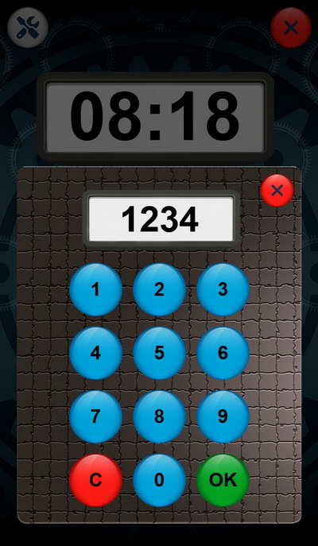

# Escape Game

This is a pure French project, sorry no english doc...

## Description

Ce projet permet de créer des scénarios d'escape game à jouer avec des cartes que vous devez créer, du type Unlock.

Vous pouvez également l'utiliser comme support pour créer de vrais escapes games.

Tout est personnalisable : les scénarios, les graphismes, les sons, les machines, ...

Seul contraintes pour créer des scénarios : savoir faire du JavaScript.

## Documentation

La documentation se trouve ici : [Documentation](./doc/README.md)

## ScreenShoots

### Ecran principal 

### Pavé numérique pour un code, une aide, une machine

### Exemple de machine : code d'entrée

### Exemple de machine : cablage électrique

### Exemple d'indice

### Paramétrages

## Help & Support

No help, no support.

## License

This program, except for the resources in the folder `./website/scenario/`, is distributed under the MIT License. For more information see the [./LICENSE.md](./LICENSE.md) file.

